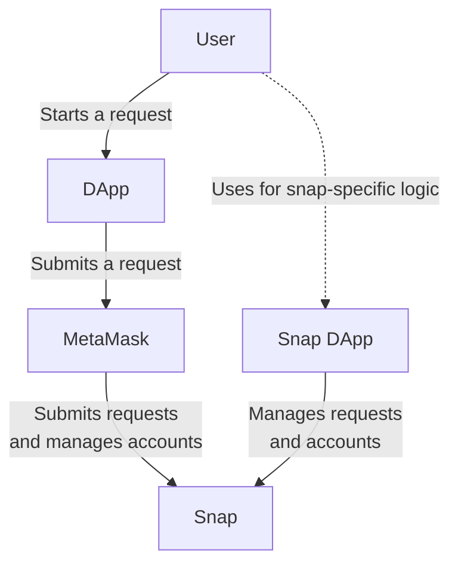
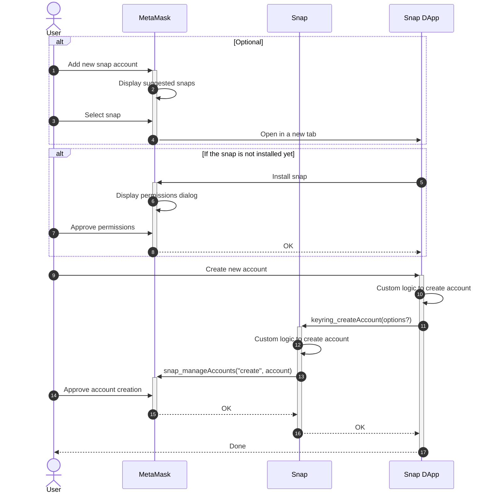

# Keyring API Architecture

## Terminology

Let's introduce some terminology used across the Keyring API:

- **Blockchain account**: An object in a single blockchain, representing an
  account, with its balance, nonce, etc.

- **Request**: A request sent by a dApp to MetaMask.

- **Keyring account**: Is an account model that represents one or more
  blockchain accounts.

- **Keyring snap**: A snap that implements the Keyring API.

- **Keyring request**: A request from MetaMask to a keyring snap, to perform an
  action on or using a keyring account. It wraps the original request sent by
  the dApp and adds some metadata to it.

## Components diagram

In most use cases, we will encounter the following components when interacting
with an account managed by a keyring snap:



- **User**: The web3 user interacting with the snap, the dApp, and MetaMask.

- **DApp**: The web3 application that is requesting an action to be performed
  on an account.

- **MetaMask**: The web3 provider that dApps connect to. It routes requests to
  the keyring snaps and lets the user perform some level of account management.

- **Snap**: A snap that implements the Keyring API to manage the user's
  accounts, and to handle requests that use these accounts.

- **Snap DApp**: The snap's UI component that allows the user to interact with
  the snap to perform custom operations on accounts and requests.

## Account creation

The account creation flow is the initial process that a user will encounter
when using a keyring snap. It can be triggered by the "Add snap account" button
in the accounts list or by the Snap DApp.



## Transaction Flow

The Keyring API supports two different flows for signing transactions:

- **Asynchronous**: MetaMask sends a keyring request to the keyring snap, and
  the keyring snap responds with a `{ pending: true, redirect? }` response
  to indicate that the keyring request will be handled asynchronously. This
  response can optionally contain a `redirect` URL that MetaMask will open in a
  new tab to allow the user to interact with the keyring snap dapp.

  Once the keyring snap has completed the request, it sends a notification to
  MetaMask with the result of the request.

  ```mermaid
  sequenceDiagram
  autonumber

  actor User
  participant DApp
  participant MetaMask
  participant Snap
  participant Site as Snap DApp

  User ->>+ DApp: Create new sign request
  DApp ->>+ MetaMask: ethereum.request(request)
  MetaMask ->> MetaMask: Display request to user
  User ->> MetaMask: Approve request

  MetaMask ->>+ Snap: keyring_submitRequest(request)
  Snap ->> Snap: Save request to snap's state
  Snap -->>- MetaMask: { pending: true, redirect? }
  alt There is a redirect URL
    User ->> MetaMask: Acknowledge redirection
    MetaMask ->>+ Site: Open redirect URL in a new tab
  end
  deactivate MetaMask

  Site ->>+ Snap: keyring_getRequests(id)
  Snap -->>- Site: request

  alt Optional
    Site ->> Site: Display request to user
    User ->> Site: Approve request
  end

  Site ->> Site: Custom logic to handle request
  Site ->>+ Snap: keyring_approveRequest(id, data?)
  Snap ->> Snap: Custom logic to handle request
  Snap ->>+ MetaMask: snap_manageAccounts("submit", id, result)

  MetaMask -->> DApp: result
  MetaMask -->>- Snap: OK
  Snap -->>- Site: OK
  deactivate Site

  DApp -->>- User: Done
  ```

- **Synchronous**: MetaMask sends a keyring request to the keyring snap, and
  the keyring snap responds with a `{ pending: false, result }` response that
  contains the result of the request.

  ```mermaid
  sequenceDiagram
  autonumber

  actor User
  participant DApp
  participant MetaMask
  participant Snap

  User ->>+ DApp: Create new sign request
  DApp ->>+ MetaMask: ethereum.request(request)
  MetaMask ->> MetaMask: Display request to user
  User ->> MetaMask: Approve request

  MetaMask ->>+ Snap: keyring_submitRequest(request)
  Snap ->> Snap: Custom logic to handle request
  Snap -->>- MetaMask: { pendind: false, result }

  MetaMask -->>- DApp: result

  DApp -->>- User: Done
  ```
