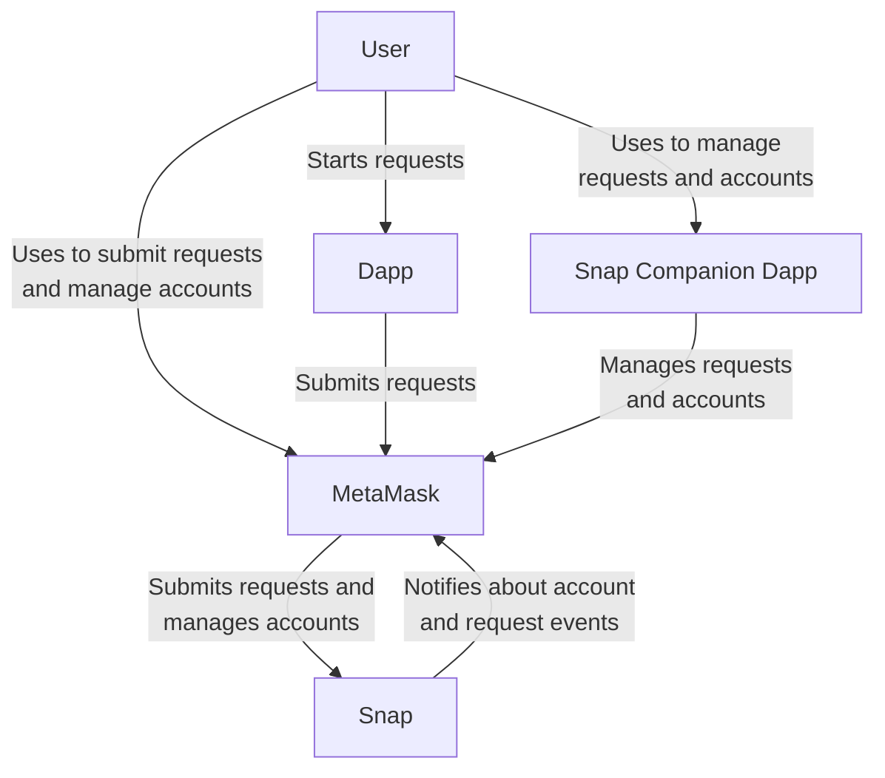
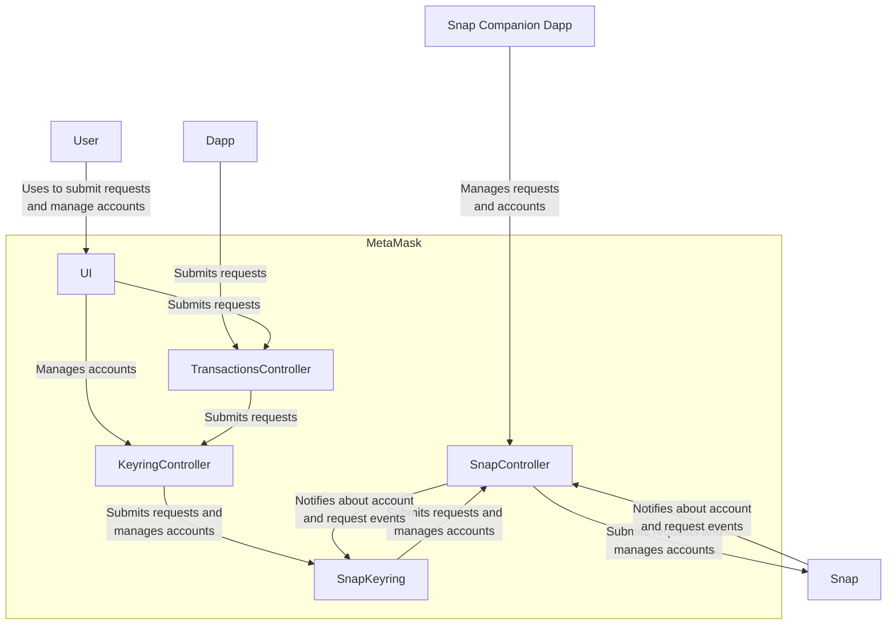
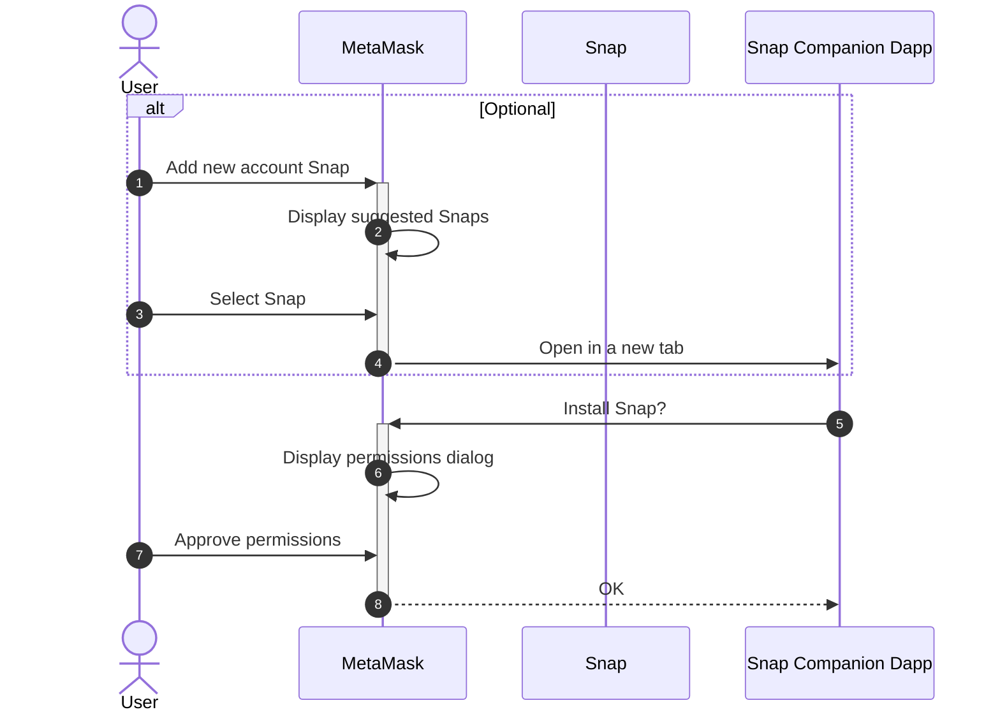
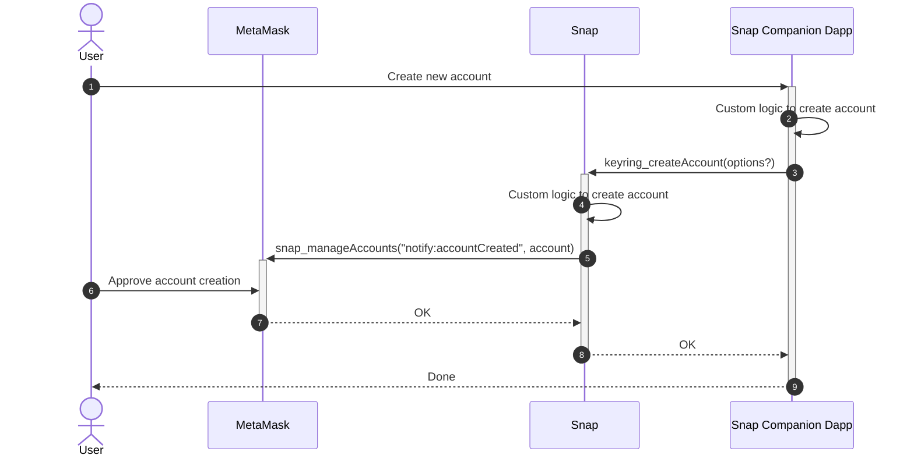
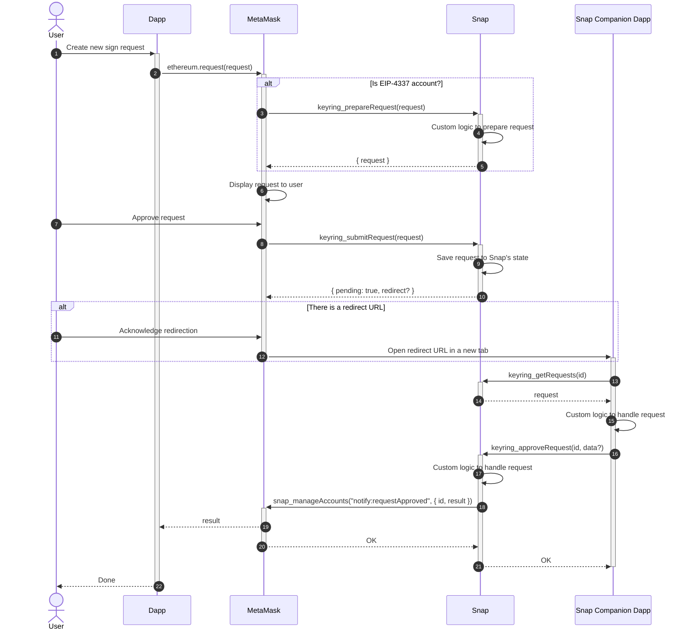
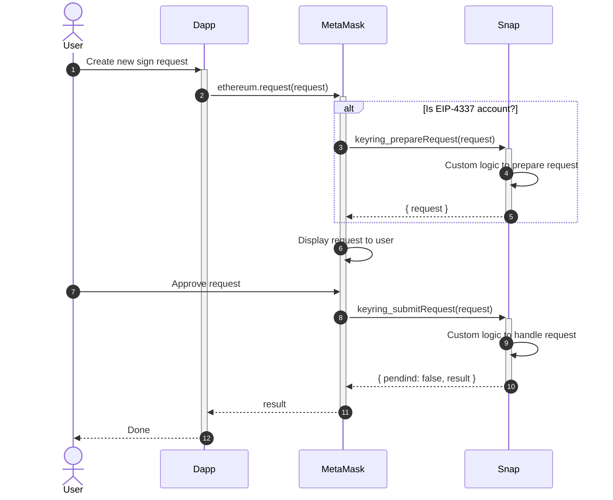

# Keyring API Architecture

## Terminology

Let's introduce some terminology used across the Keyring API:

- **Blockchain account**: An object in a single blockchain, representing an
  account, with its balance, nonce, etc.

- **Request**: A request sent by a dapp to MetaMask.

- **Keyring account**: Is an account model that represents one or more
  blockchain accounts.

- **Account Snap**: A Snap that implements the Keyring API.

- **Keyring Snap**: Same as Account Snap.

- **Keyring request**: A request from MetaMask to an account Snap to perform an
  action on, or using, a keyring account. It wraps the original request sent by
  the dapp and adds some metadata to it.

## System context diagram

In most use cases, we will encounter the following systems when interacting
with an account managed by an account Snap:

- **User**: The web3 user interacting with the dapp, the Snap companion dapp,
  and MetaMask.

- **Dapp**: The web3 application that is requesting an action to be performed
  on an account.

- **MetaMask**: The web3 provider that dapps connect to. It routes requests to
  the account Snaps and lets the user perform some level of account management.

- **Snap**: A Snap that implements the Keyring API to manage the user's
  accounts, and to handle requests that use these accounts.

- **Snap Companion Dapp**: The Snap's UI component that allows the user to
  interact with the Snap to manage accounts and requests.

## Components diagram

This components diagram shows the internal components of MetaMask and **can be
ignored by account Snap developers.**

## Snap installation

The account creation flow is the initial process that a user will encounter
when using an account Snap. It can be initiated by the "Add account Snap"
button in MetaMask's accounts list or by the Snap companion dapp.

## Account creation

Once your account Snap is installed, the user can use the Snap companion dapp
to create or import accounts.

## Transaction flows

The Keyring API supports two different types of flows for handling requests:
synchronous and asynchronous. The choice of which flow to implement depends on
the use case of the account Snap.

In general, the asynchronous flow should be used when the request requires user
interaction or when the request will take a long time to complete. The
synchronous flow should be preferred for any other use case.

### Asynchronous transaction flow

In the asynchronous transaction flow, MetaMask sends a keyring request to the
account Snap, and the account Snap responds with a `{ pending: true, redirect?
}` response to indicate that the keyring request will be handled
asynchronously. This response can optionally contain a `redirect` URL that
MetaMask will open in a new tab to allow the user to interact with the keyring
Snap companion dapp.

Once the account Snap has completed the request, it sends a notification to
MetaMask with the result of the request.

### Synchronous transaction flow

In the synchronous transaction flow, MetaMask sends a keyring request to the
account Snap, and the account Snap responds with a `{ pending: false, result }`
response that contains the result of the request.

